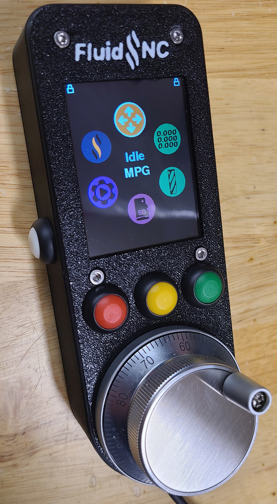
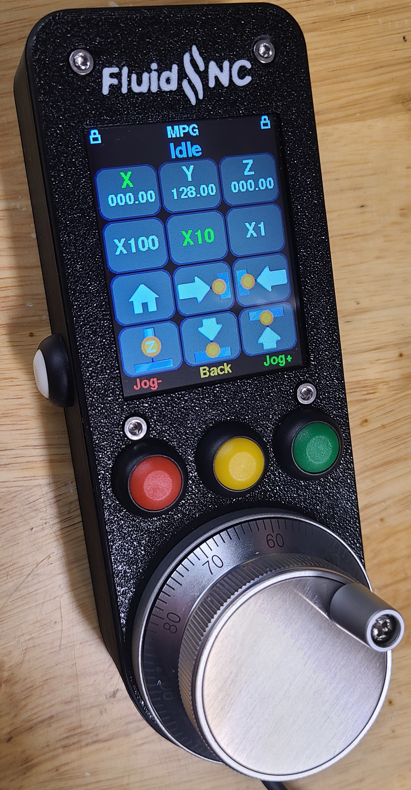

# FluidDial: A CNC Pendant for FluidNC Firmware.

Wiki pages for more information: [CYD Dial Pendant (top images)](http://wiki.fluidnc.com/en/hardware/official/CYD_Dial_Pendant) and [M5 FluidDial Pendant (bottom image)](http://wiki.fluidnc.com/en/hardware/official/M5Dial_Pendant).

Both have similar functionality and similar cost, using different hardware.
